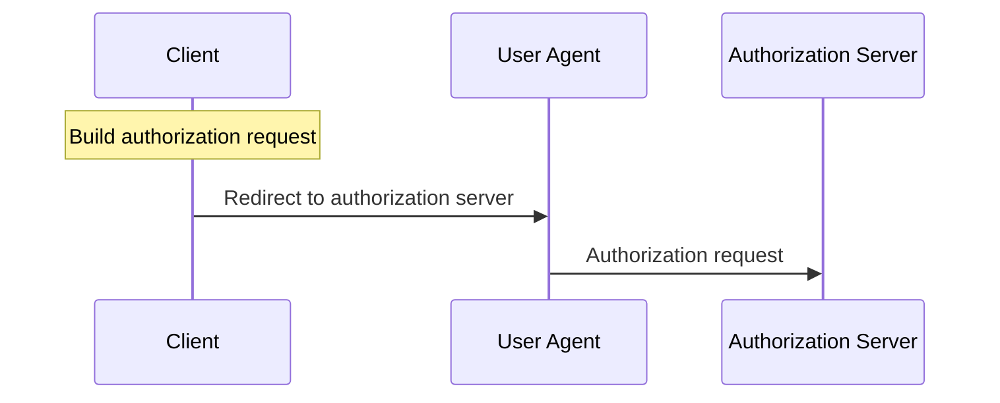

# @behavioml/generator

Experimental BehavioML generator for producing human-readable Mermaid diagrams from BehavioML model directories.

This project is intentionally small. It is not a renderer, editor, schema validator, language server, or full documentation generator. Its purpose is to stress-test whether current BehavioML model relationships can produce useful views for humans.

## Project status

`@behavioml/generator` is experimental. Generated diagrams are derived artifacts and are not a source of truth.

The generator does not validate models, including semantic-area correctness. Run @behavioml/validator first.

## Relationship to BehavioML/specifications

The [`BehavioML/specifications`](https://github.com/BehavioML/specifications) repository contains example model directories such as:

- `examples/quic/model`
- `examples/oauth-authorization-code/model`

This generator reads those model directories and emits Mermaid text for selected documentation and inspection views.

## Relationship to BehavioML/validator

The [`BehavioML/validator`](https://github.com/BehavioML/validator) package validates BehavioML models and provides:

```bash
behavioml-validate <model-dir>
```

Use the validator before generating diagrams:

```bash
behavioml-validate examples/oauth-authorization-code/model
behavioml-generate examples/oauth-authorization-code/model --format mermaid --view workflow-sequence --workflow client/start_authorization
behavioml-generate examples/oauth-authorization-code/model --format mermaid --view state-machines
```

## Installation

Install as a project dependency:

```bash
npm install @behavioml/generator
```

Or run with `npx`:

```bash
npx @behavioml/generator examples/oauth-authorization-code/model --format mermaid --view workflow-sequence --workflow client/start_authorization
```

For local development:

```bash
npm install
npm test
```


## SDK usage

Explorer and other embedders should consume generator-owned outputs through the SDK instead of reimplementing diagram semantics. The SDK accepts already-loaded workspace files, performs no filesystem IO, and returns structured artifacts with generated content plus per-artifact diagnostics.

```js
import { generateWorkspaceArtifacts } from '@behavioml/generator';

const artifacts = await generateWorkspaceArtifacts([
  {
    path: 'model/workflows/client/start_authorization.yaml',
    content: workflowYaml
  },
  {
    path: 'model/capabilities/oauth/build_authorization_request.yaml',
    content: capabilityYaml
  }
], {
  artifacts: ['workflow-sequence:client/start_authorization'],
  formats: ['mermaid'],
  expandUses: 'one-level'
});
```

Public SDK exports:

- `generateWorkspaceArtifacts(files, options)` — primary embeddable entrypoint for already-loaded workspace files.
- `loadWorkspaceModel(files)` — parses already-loaded files into the generator's in-memory model index.
- `generateModelArtifacts(model, options)` — generates structured artifacts from an in-memory model index.
- `generateMermaid(model, view, options)` — lower-level Mermaid text generation for an already-loaded model.
- `SUPPORTED_VIEWS`, `DEFAULT_GENERATOR_ARTIFACTS`, and `GENERATOR_ARTIFACT_FORMATS` — supported view/artifact metadata.

Workspace files use the same scope and identity rules as CLI model loading. Files under `generated` are ignored. Supported artifact filters are the view names documented below, `workflow-sequence:<workflow-id>` for a single workflow sequence artifact, and `semantic-area-workflows:<semantic-area-id>` for a selected semantic-area relationship graph. Mermaid is currently the only generated artifact format; unsupported requested formats are reported as diagnostics.

Generated SDK artifacts may also include a `sourceMap` array. This metadata is owned by the generator and maps stable, Mermaid/SVG-safe diagram element identifiers back to BehavioML path identities and, when applicable, specific source fields such as `steps[0].capability`. Consumers such as BehavioML Explorer should use `sourceMap` when making browser-rendered Mermaid SVG diagrams clickable: the generator owns BehavioML-to-diagram semantics, diagram element identity, and model source mapping, while Explorer or another consumer owns Mermaid rendering, SVG DOM event handling, and navigation. Consumers should not infer BehavioML semantics from raw Mermaid text or from rendered SVG heuristics.

The default CLI writes Mermaid text only. Source-map metadata is available through SDK artifacts and is not appended to CLI Mermaid output.

The CLI remains responsible for argument parsing, filesystem loading/writing, and process exit codes. The SDK deliberately does not validate BehavioML models; run `@behavioml/validator` first when validation is required.

## CLI usage

```bash
behavioml-generate <model-dir> --format mermaid --view <view> [--workflow <workflow>] [--expand-uses [one-level|recursive]] [--output <file>]
```

Required options:

- `--format mermaid` — Mermaid text is the only supported output format.
- `--view <view>` — one of the supported views below.

Optional options:

- `--workflow <workflow>` — workflow identity for `workflow-sequence`, relative to `workflows/` and without `.yaml`.
- `--expand-uses [one-level|recursive]` — for `workflow-sequence`, expand ordered `Capability.uses` under each workflow step. A bare `--expand-uses` is equivalent to `--expand-uses one-level`.
- `--output <file>` — write Mermaid text to a file instead of stdout.
- `--help` / `-h` — show usage and examples.

Exit codes:

- `0` success
- `1` generation/runtime error
- `2` CLI usage error

## Supported Mermaid views

### Documentation-grade views

Use these views for human-facing documentation.

#### `workflow-sequence`

Shows a Mermaid `sequenceDiagram` for one selected workflow using object workflow steps.

```bash
behavioml-generate examples/oauth-authorization-code/model --format mermaid --view workflow-sequence --workflow client/start_authorization
```

The `--workflow` argument identifies a workflow by path identity, relative to `workflows/`, without `.yaml`.

For example, object workflow steps such as:

```yaml
roles:
  primary: client
  participants:
    - user_agent
    - authorization_server

steps:
  - from: client
    capability: oauth/build_authorization_request
    label: Build authorization request

  - from: client
    to: user_agent
    capability: oauth/redirect_to_authorization_server
    label: Redirect to authorization server

  - from: user_agent
    to: authorization_server
    capability: oauth/receive_authorization_request
    label: Authorization request
```

produce Mermaid like:



Workflow sequence diagrams intentionally render only declared object steps:

- `from` + `to` renders an observable role-to-role interaction.
- `from` without `to` renders a local note over that role.
- `label` is used as the message/note text.
- If `label` is missing, the generator falls back to the humanized capability basename.
- Legacy string workflow steps are rejected because they are not sequence-diagrammable.
- The generator does not infer omitted interactions, callbacks, retries, webhooks, broker delivery, protocol follow-up exchanges, or role direction from capability names.

Use `--expand-uses` or `--expand-uses one-level` to add a note under each workflow step whose referenced capability declares `uses`. The note renders `Capability.uses` in declared order and attaches the list to the receiving role for role-to-role steps, or the local role for `from`-only steps. Use `--expand-uses recursive` to expand uses transitively; recursive expansion marks cycles and stops following that path.

Expanded uses represent **ordered internal decomposition**. They do **not** represent role interactions, messages, callbacks, or inferred control flow, and they are not rendered as independent role-to-role messages.

#### `state-machines`

Shows BehavioML state machines as Mermaid `stateDiagram-v2` diagrams.

```bash
behavioml-generate examples/oauth-authorization-code/model --format mermaid --view state-machines --output oauth-states.mmd
```

Array-valued transition `from` values are expanded into multiple Mermaid edges. Declared states without transitions are emitted as state declarations.

### Inspection/debug views

These relationship graph views remain available for model inspection and debugging, but they are not the primary workflow documentation views.

#### `workflow-capabilities`

Shows `Workflow -> Capability` relationships from workflow `steps`.

```bash
behavioml-generate examples/oauth-authorization-code/model --format mermaid --view workflow-capabilities
```

Missing capability references are rendered as placeholder nodes instead of failing generation.

#### `capability-events`

Shows `Capability -> Event` relationships from capability `events`.

```bash
behavioml-generate examples/oauth-authorization-code/model --format mermaid --view capability-events
```

Missing event references are rendered as placeholder nodes instead of failing generation.

#### `entity-state-machines`

Shows `Entity -> StateMachine` ownership relationships from each state machine's `entity` reference.

```bash
behavioml-generate examples/oauth-authorization-code/model --format mermaid --view entity-state-machines
```

All entities and all state machines are emitted as nodes. Entities without state machines remain visible as isolated nodes. Missing entity references are rendered as placeholder nodes instead of failing generation.


#### `semantic-area-workflows`

Shows `SemanticArea -> Workflow` relationships from each semantic area's direct top-level `workflows` list.

```bash
behavioml-generate examples/quic/model --format mermaid --view semantic-area-workflows
```

Semantic-area workflow graphs are inspection/navigation views, not executable flow diagrams. They do not render workflow steps, sequence messages, capabilities, entities, events, state machines, modules, components, or inferred ownership. Missing workflow references are rendered as placeholder nodes instead of failing generation.

Semantic areas organize behavior; modules organize components. A semantic-area file lives under `semantic-areas/`. The directory scope determines that the entity is a semantic area, so files do not need a `kind` field. The currently supported shape is:

```yaml
name: Protected packet receive
description: >-
  Behavior area covering receive-side processing of protected packets.

workflows:
  - packet/endpoint/receive_protected_packet
  - packet/endpoint/remove_header_protection
```

The generator treats `workflows` as the only semantic-area relationship field. It intentionally does not support `owns`, `model_refs`, component references, or directory-inferred workflow ownership for semantic-area generation. Validation of duplicate ownership, missing references, unsupported fields, and broader semantic-area correctness belongs to `@behavioml/validator`, which should be run before generation.

## Model loading

The generator loads `.yaml` and `.yml` files from these known scopes:

- `workflows`
- `roles`
- `capabilities`
- `interfaces`
- `components`
- `modules`
- `events`
- `entities`
- `state-machines`
- `decisions`
- `semantic-areas`

The `generated` directory is ignored. Identity is derived from the path inside each scope without the YAML extension. For example:

```text
model/capabilities/oauth/issue_access_token.yaml
```

becomes:

```text
capabilities: oauth/issue_access_token
```

## Examples

Validate first, then generate Mermaid documentation views:

```bash
behavioml-validate examples/oauth-authorization-code/model
behavioml-generate examples/oauth-authorization-code/model --format mermaid --view workflow-sequence --workflow client/start_authorization
behavioml-generate examples/oauth-authorization-code/model --format mermaid --view state-machines --output oauth-states.mmd
```

Use relationship graph views when inspecting or debugging model relationships:

```bash
behavioml-generate examples/oauth-authorization-code/model --format mermaid --view workflow-capabilities
behavioml-generate examples/oauth-authorization-code/model --format mermaid --view capability-events
behavioml-generate examples/oauth-authorization-code/model --format mermaid --view entity-state-machines
behavioml-generate examples/quic/model --format mermaid --view semantic-area-workflows
```

Generated output is plain Mermaid text and can be pasted into any Mermaid-compatible viewer.

## Limitations

This MVP intentionally does not implement:

- model validation
- SVG/PNG rendering
- Mermaid CLI integration
- HTML documentation generation
- graph layout customization
- JSON output
- watch mode
- language server support
- schema validation
- model mutation
- generated artifact writing back into specifications repositories
- publishing automation
